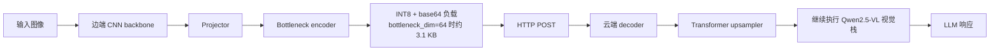

# SplitOculo

<div align="center">

**面向视觉语言模型的边云协同特征切分原型**

[English](./README.md) · [Electron GUI](./electron_gui/README.md) · [C++ 边端客户端](./cpp_edge_client/README.md)


</div>

SplitOculo 是一个面向 split VLM inference 的研究型原型。它不直接上传原始图像，也不要求在端侧运行完整的多模态模型，而是在边端保留轻量视觉编码器，将压缩后的中间特征发送到云端，再从 Qwen2.5-VL 的中间视觉层继续推理。

仓库同时包含三部分能力：

- 可训练的特征切分流水线
- 真实的 HTTP 边云部署路径
- 用于分析切分层与传输特征的实验脚本

## 项目特点

- 提供真实边云推理链路，核心脚本为 [`scripts/edge_client.py`](./scripts/edge_client.py) 与 [`scripts/cloud_server.py`](./scripts/cloud_server.py)
- 支持训练 CNN encoder、projector、bottleneck 与 cloud upsampler
- 支持通过 [`scripts/split_checkpoint.py`](./scripts/split_checkpoint.py) 将单体权重拆分为边端和云端权重
- 支持 Qwen 视觉层 `-1`、`0`、`4`、`8`、`16` 的对齐实验
- 提供离线推理模式，适合已缓存模型或无外网环境
- 附带 Electron GUI 与面向 ONNX 的 C++ 边端客户端

## 整体架构



## 系统概览

| 组件 | 边端 | 云端 |
|---|---:|---:|
| 主要模块 | MobileNetV2 + projector + bottleneck encoder | bottleneck decoder + upsampler + Qwen visual tail + LLM |
| 权重体积 | ~11 MB | ~486 MB |
| 激活参数量 | 2.87M | 126.63M |
| 传输负载 | ~3.1 KB (`bottleneck_dim=64`) | N/A |

在 `bottleneck_dim=64` 时，传输特征可从约 `61 KB` 压缩到 `3.1 KB`，压缩比约为 `20x`，未计入 HTTP 封装开销。

## 量化结果摘要

以下摘要来自内部评估结论，重点关注通用多模态能力、OCR 相关任务和幻觉倾向。

需要注意两点：

- 当前最明显的短板仍然是 OCR 与结构化图文理解。
- README 中引用的部分 split-layer 消融结果是在未启用 bottleneck 的配置下得到的，更适合作为“切分层可迁移性”的分析，不应直接视为最终压缩部署表现。

### 训练配方概览

| Variant | OCR | Structured Image Text | Image Scene | Identity Reasoning |
|---|---:|---:|---:|---:|
| SplitOculo (`CC3M-50k`) | 0.6410 | 0.4103 | 0.9423 | 0.9333 |
| SplitOculo (`50k + Text/Chart mix`) | 0.6667 | 0.4487 | 0.9423 | 0.9556 |
| SplitOculo (`LLaVA-558k recipe`) | 0.7436 | 0.4872 | 0.9808 | 0.9556 |
| Qwen2.5-VL baseline | 0.9744 | 0.6667 | 0.9808 | 1.0000 |

这些结果说明：

- 增强文本密集型训练数据能明显改善 OCR 表现
- 场景理解类任务已经可以接近基线
- 文字理解仍是当前最需要补强的方向

### COCO-5k 对齐层消融

| Split layer | OCR | Image Scene | Celebrity Recognition | Image Quality |
|---|---:|---:|---:|---:|
| `-1` | 0.2051 | 0.1827 | 0.0505 | 0.3396 |
| `0` | 0.2564 | 0.3269 | 0.1616 | 0.4340 |
| `4` | 0.4615 | 0.7885 | 0.6061 | 0.5660 |
| `8` | 0.5128 | 0.9519 | 0.7172 | 0.6038 |
| `16` | 0.3590 | 0.8942 | 0.3939 | 0.6415 |

结论上，`4` 到 `8` 层是更实用的切分区间，其中 `8` 层在这组无 bottleneck 消融中表现最好。

### 特征分布统计

基于约 `200` 张 COCO 样本：

| Layer | Mean | Std |
|---|---:|---:|
| `-1` pixel patches | -0.041 | 1.015 |
| `0` patch embedding | -0.000 | 0.362 |
| `4` block 4 | -0.022 | 0.847 |
| `8` block 8 | -0.021 | 1.066 |
| `16` block 16 | -0.030 | 2.255 |

更深层的特征分布更发散，这会提高低维压缩和重建的难度。

## 仓库结构

```text
SplitOculo/
├── core/                 # 通用工具与 Qwen 特征提取
├── models/               # projector、bottleneck、upsampler 等模型
├── scripts/              # 训练、预处理、部署、导出脚本
├── electron_gui/         # 桌面图形界面
├── cpp_edge_client/      # ONNX 导向的 C++ 边端客户端
├── checkpoints/          # 训练输出与拆分权重
├── data/                 # 本地数据与预计算特征
└── local_research/       # 研究笔记与规划文档
```

## 快速开始

### 1. 配置环境

```bash
git clone https://github.com/Shimmer22/SplitOculo.git
cd SplitOculo

conda create -n splitoculo python=3.10 -y
conda activate splitoculo
pip install -r requirements.txt
```

### 2. 准备 COCO 验证集

```bash
mkdir -p data/coco
wget http://images.cocodataset.org/zips/val2017.zip -P data/coco/
unzip data/coco/val2017.zip -d data/coco/
```

### 3. 预计算 Qwen 特征

```bash
python scripts/precompute_qwen_features.py \
  --data_dir ./data/coco \
  --output_dir ./data/coco_features_layer4 \
  --layer 4 \
  --split train

python scripts/precompute_qwen_features.py \
  --data_dir ./data/coco \
  --output_dir ./data/coco_features_layer4 \
  --layer 4 \
  --split val
```

### 4. 训练切分模型

```bash
python scripts/train_gan.py \
  --features_dir ./data/coco_features_layer4 \
  --data_dir ./data/coco \
  --phase warmup \
  --epochs 20 \
  --bottleneck_dim 64 \
  --bottleneck_method linear \
  --output_dir ./checkpoints/gan_bottleneck

python scripts/train_gan.py \
  --features_dir ./data/coco_features_layer4 \
  --data_dir ./data/coco \
  --phase gan \
  --warmup_checkpoint ./checkpoints/gan_bottleneck/warmup_best.pth \
  --epochs 30 \
  --bottleneck_dim 64 \
  --output_dir ./checkpoints/gan_bottleneck
```

### 5. 拆分部署权重

```bash
python scripts/split_checkpoint.py \
  --input ./checkpoints/gan_bottleneck/gan_best.pth \
  --output_dir ./checkpoints/gan_bottleneck/split/
```

### 6. 运行边云推理

云端：

```bash
python scripts/cloud_server.py \
  --checkpoint ./checkpoints/gan_bottleneck/split/cloud_weights.pth \
  --port 8080 \
  --offline
```

边端：

```bash
python scripts/edge_client.py \
  --checkpoint ./checkpoints/gan_bottleneck/split/edge_weights.pth \
  --image ./test.jpg \
  --server http://CLOUD_IP:8080 \
  --timeout 300
```

## 当前限制

- OCR、图表和结构化图文理解仍弱于完整 Qwen 基线
- 目前仍更接近研究原型，而不是可直接交付的生产级 SDK
- 部分实验说明仍依赖本地研究记录，复现性说明可以继续补强

## License

MIT License
