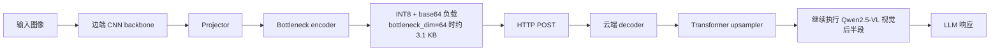

# SplitOculo

<div align="center">

**面向视觉语言模型的边云协同视觉特征切分框架**

[English](./README.md) · [Electron GUI](./electron_gui/README.md) · [C++ 边端客户端](./cpp_edge_client/README.md)


</div>

SplitOculo 是一个面向 **VLM 切分推理** 的研究型原型系统。它不走“直接上传整张图片”或“把整个多模态模型硬塞进端侧”这两条极端路线，而是在端侧保留轻量视觉编码器，把中间特征压缩后经网络发送到云端，再从 Qwen2.5-VL 的中间视觉层继续完成后续推理。

这个仓库的价值在于，它同时提供了可训练的切分流水线、真实 HTTP 边云部署路径，以及关于“应该在哪一层切分、哪些特征更适合传输”的定量实验。

## 项目亮点

- 真实边云部署路径，核心脚本为 [`scripts/edge_client.py`](./scripts/edge_client.py) 与 [`scripts/cloud_server.py`](./scripts/cloud_server.py)
- 可训练的切分流水线，包含 CNN 编码器、projector、bottleneck 与云端 upsampler
- 支持通过 [`scripts/split_checkpoint.py`](./scripts/split_checkpoint.py) 将单体权重拆分为边端权重和云端权重
- 支持对 Qwen 视觉层 `-1`、`0`、`4`、`8`、`16` 的对齐实验
- 提供离线推理模式，适合已缓存模型或无外网环境
- 额外提供 Electron GUI 和面向 ONNX 的 C++ 边端客户端，方便演示和工程扩展

## 为什么是 SplitOculo

现实中的 VLM 部署通常卡在两种方案之间。第一种是把原图直接传到云端，简单但带宽和隐私压力都大；第二种是把整个模型尽量压小放到本地，部署简单但能力容易明显退化。SplitOculo 试图做的是第三种方案：让端侧提取一个紧凑的语义表示，让云端重建更密集的视觉 token，并从视觉中间层继续推理，而不是重新从像素开始计算。

因此，这个项目既可以被看作一个工程原型，也可以被看作一个实验平台，用来研究 split-layer transferability、语义压缩和带宽约束下的多模态协同推理。

## 整体架构



## 系统概览

| 组件 | 边端 | 云端 |
|---|---:|---:|
| 主要模块 | MobileNetV2 + projector + bottleneck encoder | bottleneck decoder + upsampler + Qwen 视觉尾部 + LLM |
| 权重体积 | ~11 MB | ~486 MB |
| 激活参数量 | 2.87M | 126.63M |
| 传输负载 | ~3.1 KB（`bottleneck_dim=64`） | N/A |

当 `bottleneck_dim=64` 时，传输特征会从大约 `61 KB` 缩小到 `3.1 KB`，压缩比约为 `20x`，还未计入 HTTP 包装开销。

## 定量结果

下面的结果整理自内部实验记录 `定量损失测试VLMEvalKit.pdf`，对应 **SplitOculo v2.2**。评测工具使用的是 VLMEvalKit，重点观察综合多模态能力、OCR 相关能力，以及部分幻觉倾向测试。

有两个背景需要先说明：

- 当前最明显的短板仍然是文字类理解，尤其是 OCR 和结构化图文理解。
- 下面的层级消融实验 **没有打开 bottleneck**。这在原报告中已经说明，是一次实验配置失误。因此这组数字更适合解释“哪一层更适合作为切分层”，而不适合作为完整压缩部署效果的最终结论。

### 训练配方结果概览

| 变体 | OCR | 结构化图文理解 | 场景理解 | 身份推理 |
|---|---:|---:|---:|---:|
| SplitOculo（`CC3M-50k`） | 0.6410 | 0.4103 | 0.9423 | 0.9333 |
| SplitOculo（`50k + Text/Chart`） | 0.6667 | 0.4487 | 0.9423 | 0.9556 |
| SplitOculo（`LLaVA-558k` 方案） | 0.7436 | 0.4872 | 0.9808 | 0.9556 |
| Qwen2.5-VL 基线 | 0.9744 | 0.6667 | 0.9808 | 1.0000 |

这组结果说明了三件事：

- 加入文字强化数据是有效的。报告里提到在 `50k` 训练数据中混入 `7k` 文本增强样本后，OCR 表现会明显改善。
- 在偏场景理解的类别上，较强的 SplitOculo 训练方案已经可以接近甚至贴近基线。
- 真正的差距仍然集中在 OCR、图表、结构化图文这些文本密集型任务上，这也是后续最值得补强的方向。

### COCO-5k 对齐层级消融

| 对齐层 | OCR | 场景理解 | 名人识别 | 图像质量 |
|---|---:|---:|---:|---:|
| `-1` | 0.2051 | 0.1827 | 0.0505 | 0.3396 |
| `0` | 0.2564 | 0.3269 | 0.1616 | 0.4340 |
| `4` | 0.4615 | 0.7885 | 0.6061 | 0.5660 |
| `8` | 0.5128 | 0.9519 | 0.7172 | 0.6038 |
| `16` | 0.3590 | 0.8942 | 0.3939 | 0.6415 |

一个比较清晰的结论是：**layer 4 到 layer 8 是更实际的甜点区间**。过浅的层语义不足，恢复后难以支撑下游推理；过深的层虽然语义更强，但特征分布更发散，压缩和重建难度也更高。在这次无 bottleneck 的消融里，`layer 8` 的整体表现最好。

### 特征分布统计

基于约 `200` 张 COCO 图像的统计结果：

| 层级 | Mean | Std |
|---|---:|---:|
| `-1` 像素 patch | -0.041 | 1.015 |
| `0` patch embedding | -0.000 | 0.362 |
| `4` block 4 | -0.022 | 0.847 |
| `8` block 8 | -0.021 | 1.066 |
| `16` block 16 | -0.030 | 2.255 |

原始实验笔记中的判断也很直接：层越深，分布通常越发散，压缩带来的误差也越容易被放大。这也是为什么更深层虽然语义更成熟，却未必更适合作为低维 bottleneck 的输入。

## 仓库结构

```text
SplitOculo/
├── core/                 # 公共框架与 Qwen 特征提取
├── models/               # projector、bottleneck、upsampler 等模型模块
├── scripts/              # 训练、预处理、部署、导出脚本
├── electron_gui/         # 桌面端 GUI
├── cpp_edge_client/      # 面向 ONNX 的 C++ 边端客户端
├── checkpoints/          # 训练输出与拆分后的权重
├── data/                 # 本地数据与预计算特征
└── local_research/       # 研究笔记与规划文档
```

## 快速开始

### 1. 配置环境

```bash
git clone https://github.com/Shimmer22/SplitOculo.git
cd SplitOculo

conda create -n splitoculo python=3.10 -y
conda activate splitoculo
pip install -r requirements.txt
```

### 2. 准备 COCO 验证集图像

```bash
mkdir -p data/coco
wget http://images.cocodataset.org/zips/val2017.zip -P data/coco/
unzip data/coco/val2017.zip -d data/coco/
```

### 3. 预计算 Qwen 特征

```bash
python scripts/precompute_qwen_features.py \
  --data_dir ./data/coco \
  --output_dir ./data/coco_features_layer4 \
  --layer 4 \
  --split train

python scripts/precompute_qwen_features.py \
  --data_dir ./data/coco \
  --output_dir ./data/coco_features_layer4 \
  --layer 4 \
  --split val
```

### 4. 训练切分模型

```bash
python scripts/train_gan.py \
  --features_dir ./data/coco_features_layer4 \
  --data_dir ./data/coco \
  --phase warmup \
  --epochs 20 \
  --bottleneck_dim 64 \
  --bottleneck_method linear \
  --output_dir ./checkpoints/gan_bottleneck

python scripts/train_gan.py \
  --features_dir ./data/coco_features_layer4 \
  --data_dir ./data/coco \
  --phase gan \
  --warmup_checkpoint ./checkpoints/gan_bottleneck/warmup_best.pth \
  --epochs 30 \
  --bottleneck_dim 64 \
  --output_dir ./checkpoints/gan_bottleneck
```

### 5. 拆分部署权重

```bash
python scripts/split_checkpoint.py \
  --input ./checkpoints/gan_bottleneck/gan_best.pth \
  --output_dir ./checkpoints/gan_bottleneck/split/
```

### 6. 启动真实边云推理

云端：

```bash
python scripts/cloud_server.py \
  --checkpoint ./checkpoints/gan_bottleneck/split/cloud_weights.pth \
  --port 8080 \
  --offline
```

边端：

```bash
python scripts/edge_client.py \
  --checkpoint ./checkpoints/gan_bottleneck/split/edge_weights.pth \
  --image ./test.jpg \
  --server http://CLOUD_IP:8080 \
  --timeout 300
```

## 对齐层级实验

如果你想复现实验中的层级研究，仓库已经支持 `-1`、`0`、`4`、`8`、`16` 这些目标层。

```bash
python scripts/precompute_qwen_features.py \
  --data_dir ./data/coco \
  --output_dir ./data/coco_features_layer8 \
  --layer 8 \
  --split train
```

也可以直接测量各层的统计分布：

```bash
python scripts/measure_feature_stats.py \
  --data_dir ./data/coco \
  --split train \
  --max_files 100 \
  --realtime \
  --all_layers
```

## 当前限制

- OCR、图表和结构化图文理解仍然明显弱于完整的 Qwen 基线。
- 当前 README 中引用的一组层级消融结果是在未启用 bottleneck 的设置下得到的，因此更偏向表示分析，而不是最终部署结论。
- 这个仓库目前更像研究原型，离完整生产级 SDK 还有一段距离，尤其在评测规范、打包方式和可复现性上还可以继续加强。

## 后续方向

- 加强文本密集型训练数据与 OCR 定向适配
- 在带宽约束下加入更标准的端到端任务评测
- 从固定 token 预算走向自适应语义传输
- 增加真实边端设备上的时延与能耗测试

## License

MIT License
