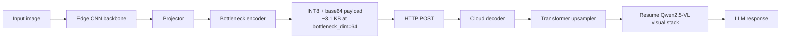

# SplitOculo

<div align="center">

**Edge-cloud collaborative feature splitting for vision-language models**

[中文说明](./README-zh.md) · [Electron GUI](./electron_gui/README.md) · [C++ Edge Client](./cpp_edge_client/README.md)


</div>

SplitOculo is a research prototype for split VLM inference. Instead of uploading raw images or running a full multimodal model on-device, it keeps a lightweight visual encoder on the edge, transmits compressed intermediate tokens, and resumes Qwen2.5-VL visual reasoning in the cloud.

The repository combines three practical parts:

- a trainable split pipeline
- a real HTTP deployment path
- experiment scripts for studying where visual features should be split and transmitted

## Highlights

- Real edge-cloud deployment with [`scripts/edge_client.py`](./scripts/edge_client.py) and [`scripts/cloud_server.py`](./scripts/cloud_server.py)
- Trainable split pipeline with CNN encoder, projector, bottleneck, and cloud upsampler
- Static checkpoint partitioning into edge weights and cloud weights via [`scripts/split_checkpoint.py`](./scripts/split_checkpoint.py)
- Layer-alignment experiments for Qwen visual layers `-1`, `0`, `4`, `8`, and `16`
- Optional offline inference path for air-gapped or pre-cached environments
- Extra interfaces for experimentation: Electron GUI and an ONNX-oriented C++ edge client

## Architecture



## System Snapshot

| Component | Edge | Cloud |
|---|---:|---:|
| Main modules | MobileNetV2 + projector + bottleneck encoder | bottleneck decoder + upsampler + Qwen visual tail + LLM |
| Weight package | ~11 MB | ~486 MB |
| Active parameters | 2.87M | 126.63M |
| Payload size | ~3.1 KB (`bottleneck_dim=64`) | N/A |

At `bottleneck_dim=64`, the transmitted feature payload shrinks from roughly `61 KB` to `3.1 KB`, about a `20x` reduction before HTTP overhead.

## Quantitative Results

The following summary comes from internal evaluation notes for **SplitOculo v2.2**. VLMEvalKit was used as the benchmark harness, with emphasis on general multimodal capability, OCR-heavy tasks, and hallucination-oriented evaluation.

Important context:

- OCR and structured image-text understanding remain the largest quality gap compared with the Qwen baseline.
- Some split-layer ablation results cited below were collected without the bottleneck enabled because of an experiment configuration mistake. Those numbers should be read as a study of layer transferability rather than the final compressed deployment setting.

### Training Recipe Snapshot

| Variant | OCR | Structured Image Text | Image Scene | Identity Reasoning |
|---|---:|---:|---:|---:|
| SplitOculo (`CC3M-50k`) | 0.6410 | 0.4103 | 0.9423 | 0.9333 |
| SplitOculo (`50k + Text/Chart mix`) | 0.6667 | 0.4487 | 0.9423 | 0.9556 |
| SplitOculo (`LLaVA-558k recipe`) | 0.7436 | 0.4872 | 0.9808 | 0.9556 |
| Qwen2.5-VL baseline | 0.9744 | 0.6667 | 0.9808 | 1.0000 |

What this suggests:

- Adding text-centric data helps OCR-oriented behavior.
- Stronger SplitOculo recipes can approach baseline on scene-heavy categories.
- Text understanding remains the main performance bottleneck.

### Split-Layer Ablation on COCO-5k Alignment

| Split layer | OCR | Image Scene | Celebrity Recognition | Image Quality |
|---|---:|---:|---:|---:|
| `-1` | 0.2051 | 0.1827 | 0.0505 | 0.3396 |
| `0` | 0.2564 | 0.3269 | 0.1616 | 0.4340 |
| `4` | 0.4615 | 0.7885 | 0.6061 | 0.5660 |
| `8` | 0.5128 | 0.9519 | 0.7172 | 0.6038 |
| `16` | 0.3590 | 0.8942 | 0.3939 | 0.6415 |

The practical takeaway is that layers `4` to `8` form the most useful operating window, with layer `8` performing best in this no-bottleneck ablation.

### Feature Distribution Statistics

Measured on roughly `200` COCO samples:

| Layer | Mean | Std |
|---|---:|---:|
| `-1` pixel patches | -0.041 | 1.015 |
| `0` patch embedding | -0.000 | 0.362 |
| `4` block 4 | -0.022 | 0.847 |
| `8` block 8 | -0.021 | 1.066 |
| `16` block 16 | -0.030 | 2.255 |

Deeper features are more dispersed, which increases the difficulty of aggressive low-dimensional compression and reconstruction.

## Repository Layout

```text
SplitOculo/
├── core/                 # shared utilities and Qwen feature extraction
├── models/               # projector, bottleneck, upsampler, student models
├── scripts/              # training, preprocessing, deployment, export
├── electron_gui/         # desktop UI for split inference
├── cpp_edge_client/      # ONNX-oriented C++ edge client
├── checkpoints/          # saved training outputs and split weights
├── data/                 # local datasets and precomputed features
└── local_research/       # research notes and planning docs
```

## Quick Start

### 1. Environment

```bash
git clone https://github.com/Shimmer22/SplitOculo.git
cd SplitOculo

conda create -n splitoculo python=3.10 -y
conda activate splitoculo
pip install -r requirements.txt
```

### 2. Prepare COCO Validation Images

```bash
mkdir -p data/coco
wget http://images.cocodataset.org/zips/val2017.zip -P data/coco/
unzip data/coco/val2017.zip -d data/coco/
```

### 3. Precompute Qwen Features

```bash
python scripts/precompute_qwen_features.py \
  --data_dir ./data/coco \
  --output_dir ./data/coco_features_layer4 \
  --layer 4 \
  --split train

python scripts/precompute_qwen_features.py \
  --data_dir ./data/coco \
  --output_dir ./data/coco_features_layer4 \
  --layer 4 \
  --split val
```

### 4. Train the Split Pipeline

```bash
python scripts/train_gan.py \
  --features_dir ./data/coco_features_layer4 \
  --data_dir ./data/coco \
  --phase warmup \
  --epochs 20 \
  --bottleneck_dim 64 \
  --bottleneck_method linear \
  --output_dir ./checkpoints/gan_bottleneck

python scripts/train_gan.py \
  --features_dir ./data/coco_features_layer4 \
  --data_dir ./data/coco \
  --phase gan \
  --warmup_checkpoint ./checkpoints/gan_bottleneck/warmup_best.pth \
  --epochs 30 \
  --bottleneck_dim 64 \
  --output_dir ./checkpoints/gan_bottleneck
```

### 5. Split the Checkpoint for Deployment

```bash
python scripts/split_checkpoint.py \
  --input ./checkpoints/gan_bottleneck/gan_best.pth \
  --output_dir ./checkpoints/gan_bottleneck/split/
```

### 6. Run Real Edge-Cloud Inference

Cloud:

```bash
python scripts/cloud_server.py \
  --checkpoint ./checkpoints/gan_bottleneck/split/cloud_weights.pth \
  --port 8080 \
  --offline
```

Edge:

```bash
python scripts/edge_client.py \
  --checkpoint ./checkpoints/gan_bottleneck/split/edge_weights.pth \
  --image ./test.jpg \
  --server http://CLOUD_IP:8080 \
  --timeout 300
```

## Limitations

- OCR, charts, and structured image-text understanding still lag behind the full Qwen baseline.
- The repository is still closer to a research prototype than a production SDK.
- Some experiment summaries still depend on local research notes and could be documented more rigorously.

## License

MIT License
