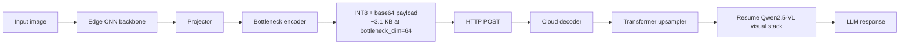

# SplitOculo

<div align="center">

**Edge-cloud collaborative feature splitting for vision-language models**

[中文说明](./README-zh.md) · [Electron GUI](./electron_gui/README.md) · [C++ Edge Client](./cpp_edge_client/README.md)


</div>

SplitOculo is a research prototype for split VLM inference. Instead of uploading raw images or running a full multimodal model on-device, it keeps a lightweight visual encoder on the edge, transmits compressed intermediate tokens, and resumes Qwen2.5-VL visual reasoning in the cloud.

The repository combines three practical parts:

- a trainable split pipeline
- a real HTTP deployment path
- experiment scripts for studying where visual features should be split and transmitted

## Highlights

- Real edge-cloud deployment with [`scripts/edge_client.py`](./scripts/edge_client.py) and [`scripts/cloud_server.py`](./scripts/cloud_server.py)
- Trainable split pipeline with CNN encoder, projector, bottleneck, and cloud upsampler
- Static checkpoint partitioning into edge weights and cloud weights via [`scripts/split_checkpoint.py`](./scripts/split_checkpoint.py)
- Layer-alignment experiments for Qwen visual layers `-1`, `0`, `4`, `8`, and `16`
- Optional offline inference path for air-gapped or pre-cached environments
- Extra interfaces for experimentation: Electron GUI and an ONNX-oriented C++ edge client

## Architecture



## System Snapshot

| Component | Edge | Cloud |
|---|---:|---:|
| Main modules | MobileNetV2 + projector + bottleneck encoder | bottleneck decoder + upsampler + Qwen visual tail + LLM |
| Weight package | ~11 MB | ~486 MB |
| Active parameters | 2.87M | 126.63M |
| Payload size | ~3.1 KB (`bottleneck_dim=64`) | N/A |

At `bottleneck_dim=64`, the transmitted feature payload shrinks from roughly `61 KB` to `3.1 KB`, about a `20x` reduction before HTTP overhead.

## Quantitative Results

The following summary comes from internal evaluation notes for **SplitOculo v2.2**. VLMEvalKit was used as the benchmark harness, with emphasis on general multimodal capability, OCR-heavy tasks, and hallucination-oriented evaluation.

Important context:

- OCR and structured image-text understanding remain the largest quality gap compared with the Qwen baseline.
- Some split-layer ablation results cited below were collected without the bottleneck enabled because of an experiment configuration mistake. Those numbers should be read as a study of layer transferability rather than the final compressed deployment setting.

### Training Recipe Snapshot

| Variant | OCR | Structured Image Text | Image Scene | Identity Reasoning |
|---|---:|---:|---:|---:|
| SplitOculo (`CC3M-50k`) | 0.6410 | 0.4103 | 0.9423 | 0.9333 |
| SplitOculo (`50k + Text/Chart mix`) | 0.6667 | 0.4487 | 0.9423 | 0.9556 |
| SplitOculo (`LLaVA-558k recipe`) | 0.7436 | 0.4872 | 0.9808 | 0.9556 |
| Qwen2.5-VL baseline | 0.9744 | 0.6667 | 0.9808 | 1.0000 |

What this suggests:

- Adding text-centric data helps OCR-oriented behavior.
- Stronger SplitOculo recipes can approach baseline on scene-heavy categories.
- Text understanding remains the main performance bottleneck.

### Split-Layer Ablation on COCO-5k Alignment

| Split layer | OCR | Image Scene | Celebrity Recognition | Image Quality |
|---|---:|---:|---:|---:|
| `-1` | 0.2051 | 0.1827 | 0.0505 | 0.3396 |
| `0` | 0.2564 | 0.3269 | 0.1616 | 0.4340 |
| `4` | 0.4615 | 0.7885 | 0.6061 | 0.5660 |
| `8` | 0.5128 | 0.9519 | 0.7172 | 0.6038 |
| `16` | 0.3590 | 0.8942 | 0.3939 | 0.6415 |

The practical takeaway is that layers `4` to `8` form the most useful operating window, with layer `8` performing best in this no-bottleneck ablation.

### Feature Distribution Statistics

Measured on roughly `200` COCO samples:

| Layer | Mean | Std |
|---|---:|---:|
| `-1` pixel patches | -0.041 | 1.015 |
| `0` patch embedding | -0.000 | 0.362 |
| `4` block 4 | -0.022 | 0.847 |
| `8` block 8 | -0.021 | 1.066 |
| `16` block 16 | -0.030 | 2.255 |

Deeper features are more dispersed, which increases the difficulty of aggressive low-dimensional compression and reconstruction.

## Repository Layout

```text
SplitOculo/
├── core/                 # shared utilities and Qwen feature extraction
├── models/               # projector, bottleneck, upsampler, student models
├── scripts/              # training, preprocessing, deployment, export
├── electron_gui/         # desktop UI for split inference
├── cpp_edge_client/      # ONNX-oriented C++ edge client
├── checkpoints/          # saved training outputs and split weights
├── data/                 # local datasets and precomputed features
└── local_research/       # research notes and planning docs
```

## Quick Start

### 1. Environment

```bash
git clone https://github.com/Shimmer22/SplitOculo.git
cd SplitOculo

conda create -n splitoculo python=3.10 -y
conda activate splitoculo
pip install -r requirements.txt
```

### 2. Prepare COCO Validation Images

```bash
mkdir -p data/coco
wget http://images.cocodataset.org/zips/val2017.zip -P data/coco/
unzip data/coco/val2017.zip -d data/coco/
```

### 3. Precompute Qwen Features

```bash
python scripts/precompute_qwen_features.py \
  --data_dir ./data/coco \
  --output_dir ./data/coco_features_layer4 \
  --layer 4 \
  --split train

python scripts/precompute_qwen_features.py \
  --data_dir ./data/coco \
  --output_dir ./data/coco_features_layer4 \
  --layer 4 \
  --split val
```

### 4. Train the Split Pipeline

```bash
python scripts/train_gan.py \
  --features_dir ./data/coco_features_layer4 \
  --data_dir ./data/coco \
  --phase warmup \
  --epochs 20 \
  --bottleneck_dim 64 \
  --bottleneck_method linear \
  --output_dir ./checkpoints/gan_bottleneck

python scripts/train_gan.py \
  --features_dir ./data/coco_features_layer4 \
  --data_dir ./data/coco \
  --phase gan \
  --warmup_checkpoint ./checkpoints/gan_bottleneck/warmup_best.pth \
  --epochs 30 \
  --bottleneck_dim 64 \
  --output_dir ./checkpoints/gan_bottleneck
```

### 5. Split the Checkpoint for Deployment

```bash
python scripts/split_checkpoint.py \
  --input ./checkpoints/gan_bottleneck/gan_best.pth \
  --output_dir ./checkpoints/gan_bottleneck/split/
```

### 6. Run Real Edge-Cloud Inference

Cloud:

```bash
python scripts/cloud_server.py \
  --checkpoint ./checkpoints/gan_bottleneck/split/cloud_weights.pth \
  --port 8080 \
  --offline
```

Edge:

```bash
python scripts/edge_client.py \
  --checkpoint ./checkpoints/gan_bottleneck/split/edge_weights.pth \
  --image ./test.jpg \
  --server http://CLOUD_IP:8080 \
  --timeout 300
```

### 7. Run Video Inference

The default video path independently runs the edge CNN on every sampled frame:

```bash
python scripts/infer_splitoculo_video.py \
  --video ./test.mp4 \
  --edge_checkpoint ./checkpoints/gan_bottleneck/split/edge_weights.pth \
  --cloud_checkpoint ./checkpoints/gan_bottleneck/split/cloud_weights.pth \
  --sample_fps 2 \
  --max_frames 8 \
  --offline
```

Add `--codec_acc` to use real motion vectors exported by the software decoder.
The decoder backend is the default and processes intervening source P-frames so
reference feature state reaches each sparsely sampled VLM frame:

```bash
python scripts/infer_splitoculo_video.py \
  --video ./test.mp4 \
  --edge_checkpoint ./checkpoints/gan_bottleneck/split/edge_weights.pth \
  --cloud_checkpoint ./checkpoints/gan_bottleneck/split/cloud_weights.pth \
  --sample_fps 2 \
  --max_frames 8 \
  --codec_acc \
  --offline
```

The implementation uses PyAV/libavcodec `AV_FRAME_DATA_MOTION_VECTORS`. I-frames
run the full CNN. The optimized P-frame path analytically preserves the legacy
resize/crop/bilinear flow sampling while gathering only the source pixels needed
by the small CNN feature grid; PyTorch `grid_sample` then recursively warps the
reference feature on either CPU or CUDA. Selected B-frames safely fall back to
the full CNN because their future reference is unavailable in display order.
The current one-reference state assumes normal IP or non-reference-B streams;
re-encode with `-bf 0` for the cleanest first deployment test. A learned
residual correction can be enabled after training the MMNet-style memory below.

### 8. Train temporal pair fusion from an existing checkpoint

The temporal module is trained separately from the existing edge/cloud models.
The old `edge_weights.pth` and `cloud_weights.pth` stay frozen; only the small
`TemporalPairFusion` is optimized against native two-frame Qwen visual features.
An old spatial checkpoint can therefore support the temporal demo without
retraining the split GAN.

For mainland-China connectivity, download the public 10-class UCF101 subset and
create balanced manifests:

```bash
python scripts/download_ucf101_subset.py \
  --output_dir data/ucf101_subset \
  --train_limit 100 \
  --val_limit 30 \
  --test_limit 30
```

The script supports resumable downloads, safe extraction, and writes train/val/
test manifests. It falls back to PyAV when OpenCV cannot decode an AVI file.

Cache native frame-pair targets with the locally cached Qwen2.5-VL-32B model:

```bash
QWEN32B=/path/to/Qwen2.5-VL-32B-Instruct
python scripts/train_temporal_pair.py \
  --stage cache \
  --video_manifest data/ucf101_subset/ucf101_train_100.manifest.txt \
  --cache_dir outputs/temporal_cache_ucf101_train100 \
  --qwen_path "$QWEN32B" \
  --split_layer 4 \
  --max_pairs_per_video 2 \
  --static_ratio 0.25 \
  --device cuda \
  --offline
```

Train and evaluate using the existing split checkpoints:

```bash
python scripts/train_temporal_pair.py \
  --stage train \
  --cache_dir outputs/temporal_cache_ucf101_train100 \
  --val_cache_dir outputs/temporal_cache_ucf101_val30 \
  --edge_checkpoint checkpoints/ckpt/split/edge_weights.pth \
  --cloud_checkpoint checkpoints/ckpt/split/cloud_weights.pth \
  --qwen_path Qwen/Qwen2.5-VL-32B-Instruct \
  --split_layer 4 \
  --epochs 10 \
  --batch_size 8 \
  --output_dir outputs/temporal_pair_ucf101_32b \
  --device cuda \
  --offline

python scripts/train_temporal_pair.py \
  --stage eval \
  --cache_dir outputs/temporal_cache_ucf101_val30 \
  --temporal_checkpoint outputs/temporal_pair_ucf101_32b/temporal_pair_best.pth \
  --edge_checkpoint checkpoints/ckpt/split/edge_weights.pth \
  --cloud_checkpoint checkpoints/ckpt/split/cloud_weights.pth \
  --split_layer 4 \
  --device cuda \
  --offline
```

Existing teacher-cache entries are reused; add `--overwrite_cache` to rebuild
them. Resume a temporal run with `--resume_checkpoint ...`; `--epochs` is the
total target epoch count.

### MMNet-style residual correction

The codec accelerator now supports a lightweight memory module inspired by
MMNet: decoder MVs align the previous CNN feature, while a decoded-RGB residual
proxy corrects new appearance information. The correction is intentionally not
randomly enabled; train it on real compressed video sequences first:

```powershell
python scripts/train_codec_memory.py `
  --edge_checkpoint checkpoints/gan_bottleneck/split/edge_weights.pth `
  --video outputs/codec_mv_ip_only/babycrawling_ip.mp4 `
  --output checkpoints/codec_memory/mmnet_best.pth `
  --epochs 10 `
  --max_videos 200
```

Use multiple `--video` paths from the same codec family and deployment camera
distribution, or pass a newline-delimited `--video_manifest`. The trainer
freezes the existing edge CNN and learns a small
gated residual memory against the full-CNN feature of each P-frame. It uses
`decoded_current - MV_warp(decoded_reference)` as a portable residual proxy.

For a small public smoke dataset, the Hugging Face `sayakpaul/ucf101-subset`
contains 10 action classes and can be downloaded without Ego4D credentials.
Use a balanced manifest of at most 200 training videos. The cache avoids
re-decoding and re-running the frozen teacher CNN on every epoch:

```powershell
python scripts/train_codec_memory.py `
  --edge_checkpoint checkpoints/cc3m10k_multilevel_layer4/split_gan_best/edge_weights.pth `
  --video_manifest E:/datasets/ucf101_subset/ucf101_train_200.manifest.txt `
  --max_videos 200 `
  --max_frames 16 `
  --sample_fps 30 `
  --cache_dir outputs/codec_cache_ucf101_200 `
  --target_batch_size 32 `
  --epochs 3 `
  --output outputs/codec_memory_ucf101/mmnet_ucf101_200.pth `
  --device cuda
```

The UCF101 model is a codec-memory pretraining checkpoint, not an egocentric
deployment result; validate again on first-person videos before enabling it.
After training, enable it with a coverage guard:

```powershell
python scripts/infer_splitoculo_video.py `
  --video ./test.mp4 `
  --edge_checkpoint checkpoints/gan_bottleneck/split/edge_weights.pth `
  --cloud_checkpoint checkpoints/gan_bottleneck/split/cloud_weights.pth `
  --sample_fps 2 `
  --max_frames 8 `
  --codec_acc `
  --codec_memory_checkpoint checkpoints/codec_memory/mmnet_best.pth `
  --codec_mv_min_coverage 0.98 `
  --codec_max_p_chain 8 `
  --offline
```

Without `--codec_memory_checkpoint`, the path remains the original warp-only
baseline. Metadata distinguishes `P_MV`, `P_MMNET`, and `P_FULL_FALLBACK` frames.
`--codec_max_p_chain` adds a periodic full-CNN refresh guard for long recursive
P chains; zero disables it.

The default trainer architecture is now `lsfa`, which adds a learned residual
projection and a compact current-RGB branch on top of MV-warped features. To
train and run this branch explicitly:

```powershell
python scripts/train_codec_memory.py `
  --video_manifest E:/datasets/ucf101_subset/ucf101_train_200.manifest.txt `
  --edge_checkpoint checkpoints/cc3m10k_multilevel_layer4/split_gan_best/edge_weights.pth `
  --memory_arch lsfa `
  --max_videos 200 `
  --output outputs/codec_memory_ucf101/lsfa_ucf101_200.pth

python scripts/infer_splitoculo_video.py `
  --video ./test.mp4 `
  --edge_checkpoint checkpoints/cc3m10k_multilevel_layer4/split_gan_best/edge_weights.pth `
  --cloud_checkpoint checkpoints/cc3m10k_multilevel_layer4/split_gan_best/cloud_weights.pth `
  --codec_acc --codec_mv_backend decoder `
  --codec_memory_checkpoint outputs/codec_memory_ucf101/lsfa_ucf101_200.pth `
  --codec_memory_arch lsfa `
  --offline
```

`lsfa` is LSFA-inspired rather than a byte-for-byte reproduction: the current
PyAV path exposes decoded RGB and motion vectors, but not the native codec
residual tensor. The implementation therefore uses decoded-RGB appearance
correction at the edge feature grid and records `P_LSFA` in frame metadata.

`--codec_flow_impl feature_grid` is the default numerically equivalent optimized
path. Use `feature_grid_center` only for the faster approximate mapping, or
`dense` to reproduce the legacy full-resolution flow pipeline.

For per-frame recursive drift, run the chain benchmark:

```powershell
python scripts/benchmark_codec_chain.py `
  --video ./test.mp4 `
  --edge_checkpoint checkpoints/cc3m10k_multilevel_layer4/split_gan_best/edge_weights.pth `
  --memory_checkpoint outputs/codec_memory_ucf101/mmnet_ucf101_200.pth `
  --sample_fps 15 `
  --max_frames 25 `
  --output outputs/codec_memory_ucf101/chain.json
```

It reports first/last/minimum cosine, per-frame MSE, P-chain length, B-frame
fallbacks, and the exact `P_MV`/`P_MMNET` modes.

The earlier RGB/Farneback proxy remains available explicitly:

```bash
python scripts/infer_splitoculo_video.py \
  ... \
  --codec_acc \
  --codec_mv_backend farneback \
  --codec_gop_frames 4
```

`--codec_gop_frames` only controls this Farneback backend. The decoder backend
follows actual codec I/P/B frame types and references. Run metadata records PTS,
source frame index, frame type, MV count, block coverage, fallback reason, and
both processed-source and sampled-frame CNN/warp counts.

Synchronized CPU/CUDA benchmarks and the current go/no-go assessment are in
[`docs/codec_mv_performance.md`](docs/codec_mv_performance.md). Direct
feature-grid flow is faster on both CPU and CUDA, including sparse I/P-only
sampling. Answer drift and selected B-frame fallback still prevent enabling the
path by default.

For a local NVIDIA GPU treated as the edge device, prefer full-CNN
microbatching whenever buffering is acceptable:

```powershell
python scripts/infer_splitoculo_video.py `
  ... `
  --edge_batch_size 8
```

Decoder-MV inference can instead defer only projector/bottleneck work with
`--codec_projection_batch_size 4`. The LSFA appearance path defaults to
`--codec_memory_rgb_mode exact`; `fast` is an explicit quality trade-off.
Measured operating points and rejected FP16/TorchScript experiments are in
[`docs/local_gpu_edge_optimization.md`](docs/local_gpu_edge_optimization.md).

## Bandwidth Benchmark

We conducted comprehensive bandwidth-limited tests to evaluate the effectiveness of neural compression under different network conditions. The experiments simulate BLE, 3G, 4G, and LAN environments.

### Test Configuration

- **Edge Device**: Radxa Rock 5B Plus (aarch64), CPU mode
- **Test Image**: COCO val2017 (210.7 KB original)
- **Iterations**: 3 per configuration

### Payload Size Comparison

| Method | Payload Size | Compression Ratio |
|--------|-------------|-------------------|
| Raw Image (Base64) | 210.70 KB | 1x (baseline) |
| JPEG Q85 | 16.56 KB | 12.7x |
| JPEG Q95 | 29.46 KB | 7.2x |
| **Neural Compressed** | **4.16 KB** | **50.6x** |

### Performance Under Different Network Conditions

| Bandwidth | Neural Compressed | Raw Image | JPEG Q85 | JPEG Q95 |
|-----------|------------------|-----------|----------|----------|
| BLE Low (62.5 KB/s) | **211.8 ms** | 3437.2 ms | 321.5 ms | 510.1 ms |
| BLE (125 KB/s) | **234.9 ms** | 1753.2 ms | 233.8 ms | 303.7 ms |
| 3G (250 KB/s) | 203.4 ms | 913.1 ms | **168.5 ms** | 178.4 ms |
| 4G (1250 KB/s) | 167.5 ms | 285.0 ms | 91.8 ms | **77.5 ms** |
| LAN (125000 KB/s) | 156.4 ms | 81.5 ms | 42.4 ms | **52.0 ms** |

### Speedup vs Raw Image

| Bandwidth | Neural vs Raw | JPEG Q85 vs Raw | JPEG Q95 vs Raw |
|-----------|--------------|-----------------|-----------------|
| BLE Low | **16.23x** | 10.69x | 6.74x |
| BLE | **7.46x** | 7.50x | 5.77x |
| 3G | **4.49x** | 5.42x | 5.12x |
| 4G | 1.70x | 3.10x | 3.68x |
| LAN | 0.52x | 1.92x | 1.57x |

### Key Findings

1. **BLE/Weak Network**: Neural compression achieves **16x speedup** over raw image transmission, making it the only viable option for ultra-low bandwidth scenarios.

2. **Bandwidth-Critical Region**: Neural compression excels when bandwidth ≤ 250 KB/s (BLE, 3G), where encoding overhead (~120ms) is negligible compared to transmission time savings.

3. **High Bandwidth**: JPEG compression becomes more efficient when bandwidth is abundant (>1 Mbps), due to its lower encoding overhead (~9ms vs ~120ms).

4. **Crossover Point**: The break-even point is around 4G speeds (~10 Mbps), where JPEG and Neural compression show similar total latency.

### Deployment Recommendations

| Scenario | Recommended Method | Rationale |
|----------|-------------------|-----------|
| BLE / IoT devices | **Neural Compressed** | Only viable option, 16x faster |
| Mobile network (3G/weak 4G) | **Neural Compressed** | 4-5x speedup, robust to bandwidth fluctuation |
| WiFi / Strong 4G | JPEG Q85/Q95 | Lower encoding overhead |
| Data center / LAN | JPEG Q85 | Simpler pipeline, adequate quality |

### Benchmark Scripts

All benchmark scripts are available in `scripts/benchmark/`:

- `mock_bandwidth_server.py` - Simulates different network bandwidths
- `bandwidth_limited_test.py` - Runs comprehensive bandwidth comparison
- `bandwidth_test.py` - Basic bandwidth testing

## Limitations

- OCR, charts, and structured image-text understanding still lag behind the full Qwen baseline.
- The repository is still closer to a research prototype than a production SDK.
- Some experiment summaries still depend on local research notes and could be documented more rigorously.

## License

MIT License
